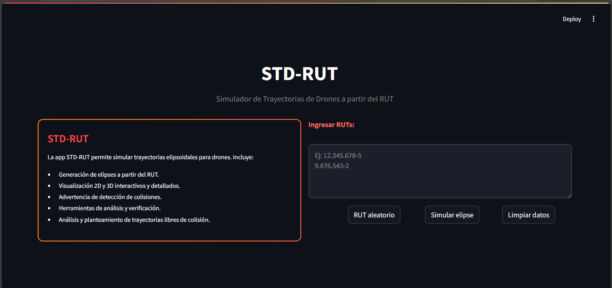
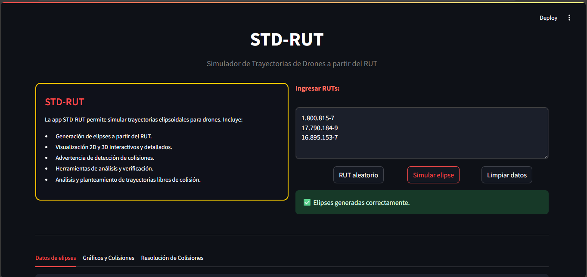
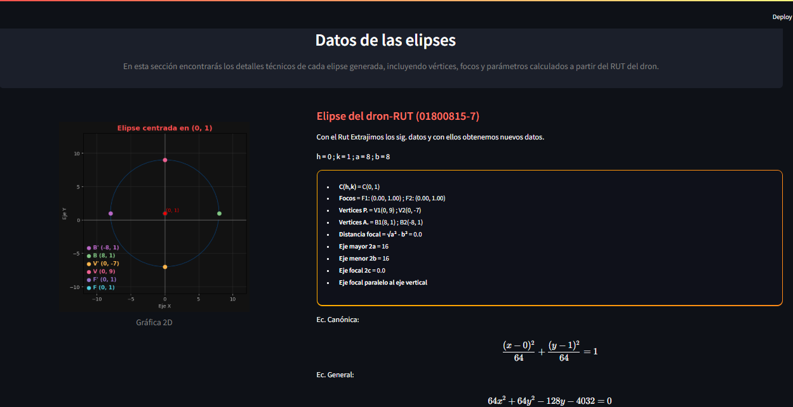
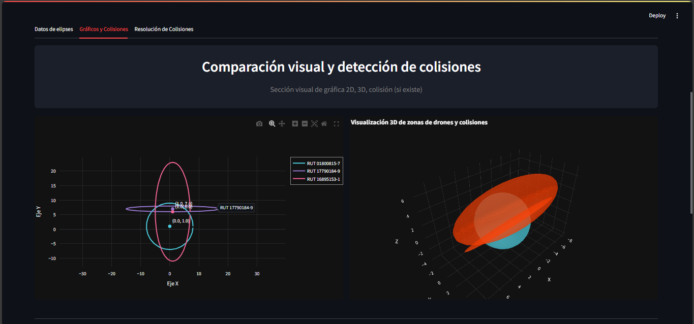
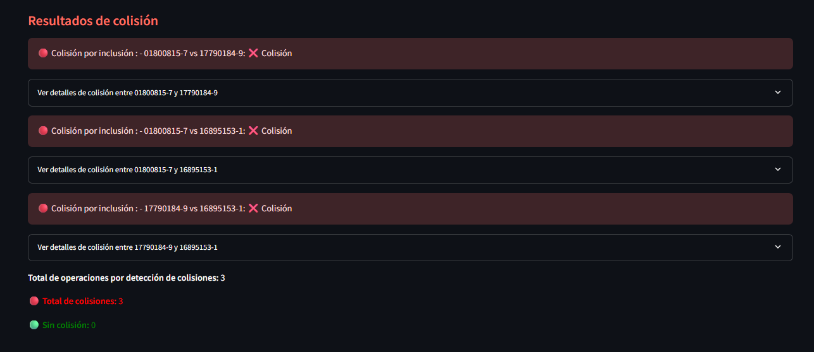
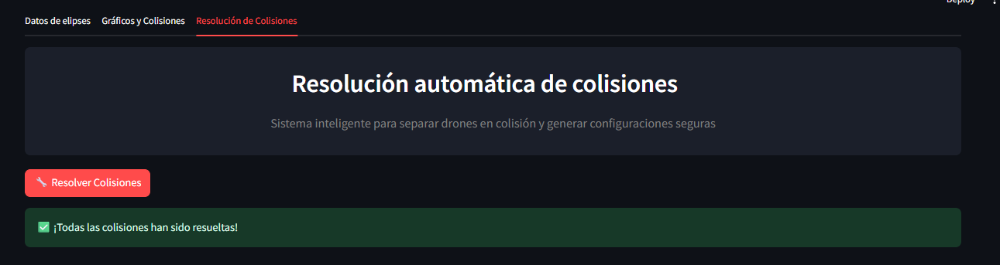
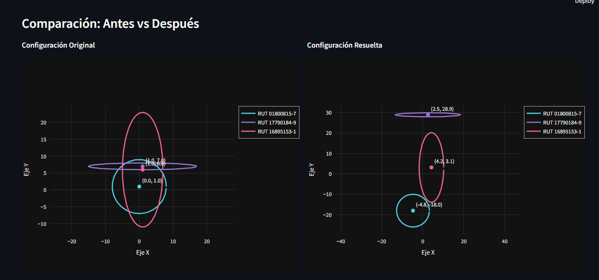
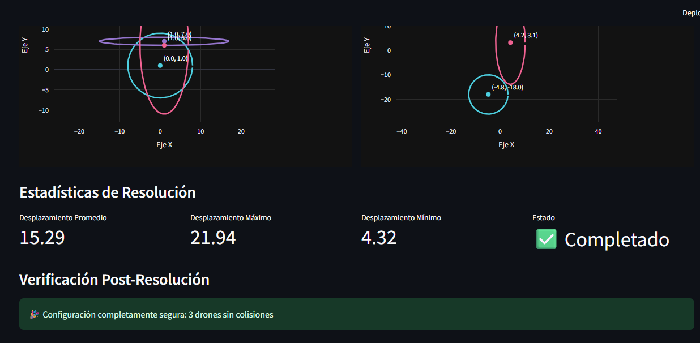

# Sistema de Monitoreo de Drones


<div align="center">
  
  <br/>
  <i>Simula la trayectoria de un dron a través del RUT ingresado</i>
</div>

## 📝 Contexto del proyecto

En la Universidad Católica de Temuco, se investigan trayectorias seguras para drones en entornos urbanos como eventos masivos o inspecciones de estructuras civiles.

Estas trayectorias se modelan mediante secciones cónicas (elipses), asociadas al RUT del operador, con el fin de garantizar seguridad y eficiencia en misiones autónomas.

El proyecto está a cargo de estudiantes de Ingeniería Civil Informática, quienes deben diseñar, simular y validar dichas trayectorias, aplicando geometría analítica, programación y modelado matemático. El desarrollo se organiza por fases, integrando teoría y práctica.

<div align="center">
  
</div>

## ✨ Características Principales

### 🔷 Generación de Trayectorias

- Transformación de RUTs chilenos en parámetros elipsoidales
- Modelado matemático preciso de trayectorias
- Visualización 2D y 3D interactiva

### 🔶 Análisis de Colisiones

- Detección avanzada de intersecciones entre drones
- Clasificación de colisiones: leve, moderada, severa e inclusión
- Identificación precisa de puntos de intersección

### ⚙️ Resolución Automática

- Algoritmos inteligentes para separación de drones
- Minimización de desplazamientos durante la resolución
- Verificación automática posterior a la resolución

### 📊 Visualización

- Gráficos interactivos con **Plotly**
- Comparación visual antes y después de la resolución de colisiones
- Estadísticas detalladas de desempeño

## 📸 Galería de Capturas

<table>
  <tr>
    <td>
      
      <p align="center"><i>Programa en ejecución</i></p>
    </td>
    <td>
      
      <p align="center"><i>P1: Datos de elipses</i></p>
    </td>
  </tr>
  <tr>
    <td>
      
      <p align="center"><i>P2: Gráficos 2D-3D interactivo</i></p>
    </td>
    <td>
      
      <p align="center"><i>P2: Información detallada de colisiones</i></p>
    </td>
  </tr>
  <tr>
    <td>
      
      <p align="center"><i>P3: Resolución de colisiones</i></p>
    </td>
    <td>
      
      <p align="center"><i>Comparación grafíca de antes y después</i></p>
    </td>
  </tr>
  <tr>
    <td colspan="2" align="center">
      
      <p align="center"><i>Información de la Resolución</i></p>
    </td>
  </tr>
</table>

## 🛠️ Especificaciones Técnicas

### Stack Tecnológico
- **Backend**: Python 3.
- **Frontend**: HTML, CSS.
- **Despliegue**: Servidor local (localhost:8501)
### Librerías
- **Streamlit** – Interfaz web interactiva
- **Plotly** – Visualizaciones dinámicas 2D y 3D
- **Matplotlib** – Gráficos estáticos
- **NumPy** – Cálculos matemáticos de bajo nivel
- **Math** – manejo de las fórmulas(cos,sen,pi,etc)
- **Io** – manejo en el flujo de datos
- **Base64** – combertir excel a streamlit
- **Random** - Generar valores aleatorio
- **Scipy** - Cálculos cientificos y teórico avanzados
- **Pytest** Framework para pruebas automatizados en Python

## 🔧 Instalaciones 

Para ejecutar este proyecto localmente, sigue los pasos a continuación:
1. **Clonar el repositorio desde GitHub:** Para obtener una copia del código fuente.
  ```
  git clone https://github.com/Yaninna137/eid_calculo_1
  cd eid_calculo_1
  ```

2. **Instalar dependencias necesarias:** Utilizando el archivo requirements.txt, que contiene todas las bibliotecas requeridas para el funcionamiento correcto de la aplicación.
  ```
  pip install -r requirements.txt
  ```

## 🚀 Como Ejecutar

### Opción 1 - Ejecutar la app desde el navegador

Esta aplicación ha sido desplegada utilizando **[Streamlit Cloud](https://streamlit.io/)**, una plataforma que permite ejecutar aplicaciones de Python directamente desde el navegador, sin necesidad de instalaciones locales.

Gracias a Streamlit, el usuario puede interactuar con la herramienta de forma simple y eficiente desde cualquier dispositivo conectado a Internet.

🔗 **Accede a la app desde este enlace:**

[https://eidcalculo1-5gbdyvghi4a8plrsrvzmp9.streamlit.app/](https://eidcalculo1-5gbdyvghi4a8plrsrvzmp9.streamlit.app/)

### Opción 2 - Ejecutar la app desde el ordenador(código fuente)
En caso de haber clonado e instalado las dependencias. Se realiza el sig. comando para ejecutar.

```
streamlit run app/main.py
```
Este abre tu navegador http://localhost:8501/

## 💻 Cómo usar

La aplicación está diseñada para ser intuitiva y fácil de utilizar. Solo debes seguir los siguientes pasos:

1. Ingresa los RUT en el formato: **xx.xxx.xxx-x**.  
2. Presiona el botón **Simular elipse**. 
3. Se mostrarán **3 pestañas** de navegación::
   - **P1:** Información individual de cada elipse.
   - **P2:** Gráficos 2D/3D e información sobre colisiones.
   - **P3:**  Visualización de trayectorias seguras.
4. Para ingresar nuevos RUT, presiona el botón **Limpiar datos**.

## ⚡ Rendimiento

La aplicación está optimizada para simular múltiples elipses de forma simultánea a partir de RUTs ingresados por el usuario. En escenarios con hasta 6 RUTs, la ejecución es fluida y la visualización de resultados (gráficos, colisiones e información detallada) ocurre sin retrasos perceptibles. 

Sin embargo, al ingresar 7 o más RUTs, el tiempo de procesamiento demorara más en cargar, debido a los cálculos adicionales que deben realizarse y la necesidad de renderizar más datos visuales. Aun así, el sistema sigue siendo funcional y confiable, manteniendo la integridad de los resultados entregados.

## 📚 Contexto Académico

Proyecto desarrollado para la asignatura **MAT1186 – Introducción al Cálculo**, con los siguientes objetivos:

- Implementar operaciones con elementos canónicos
- Aplicar conceptos de geometría analítica en contextos reales
- Desarrollar habilidades de modelado matemático y análisis de trayectorias
- Integrar teoría y práctica desde una perspectiva computacional

## 👥 Equipo de Desarrollo

Desarrollado por estudiantes de **Ingeniería Civil Informática** como parte de su formación en:

- Programación científica
- Matemáticas aplicadas
- Desarrollo de sistemas complejos

---

<div align="center">
  <p>Hecho para el curso MAT1186</p>
</div>